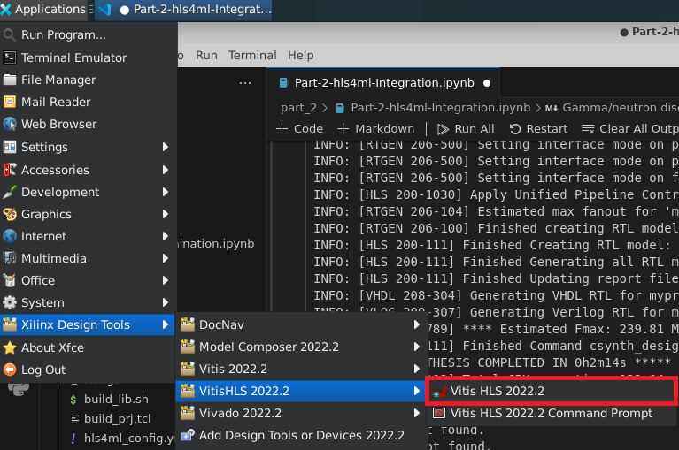
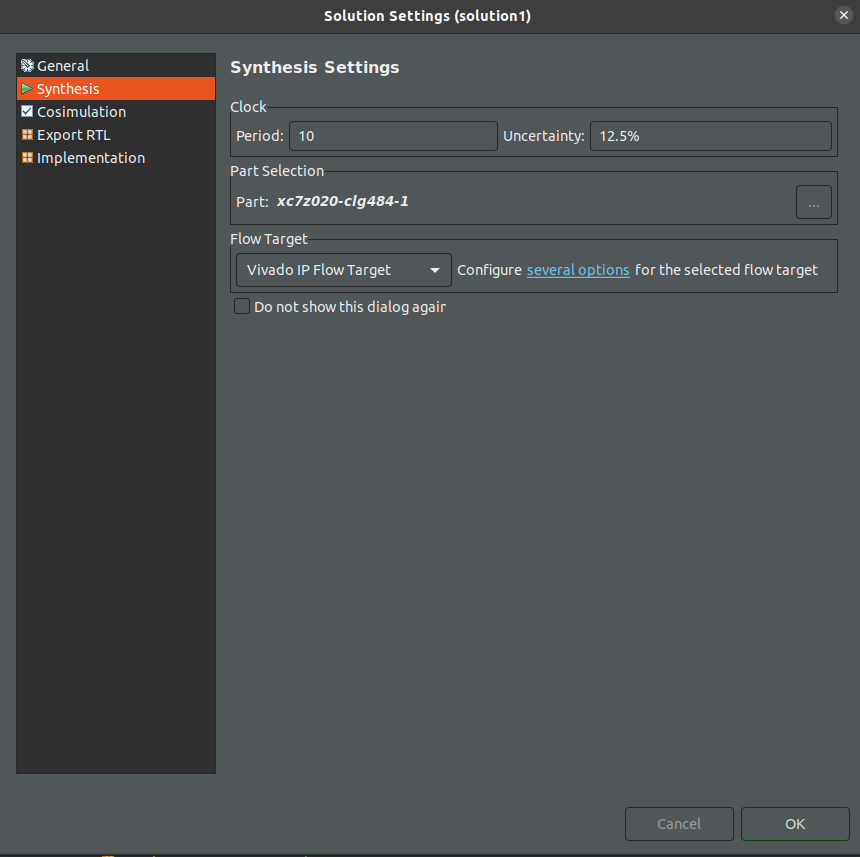
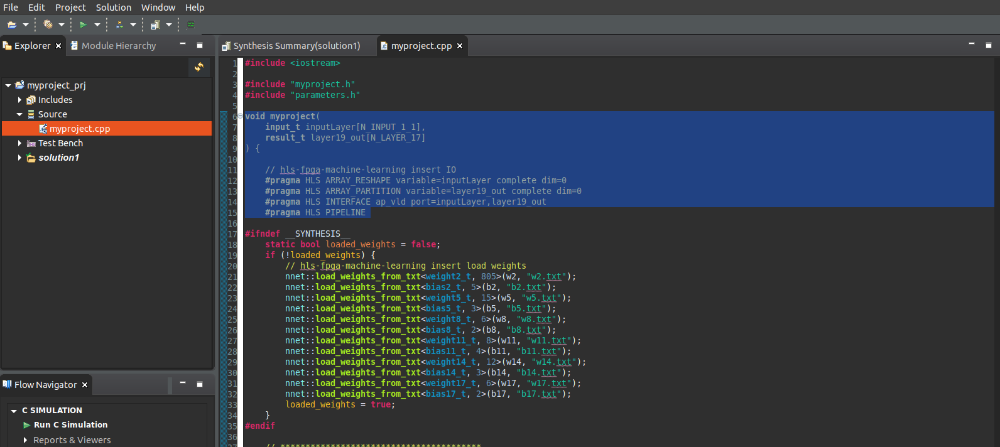
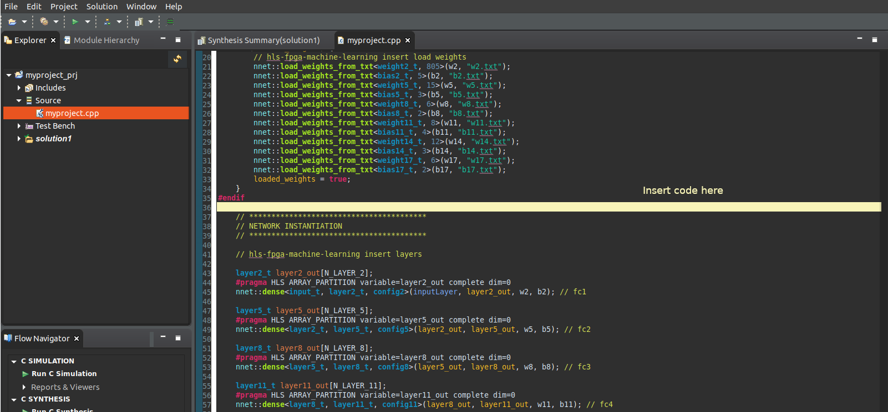
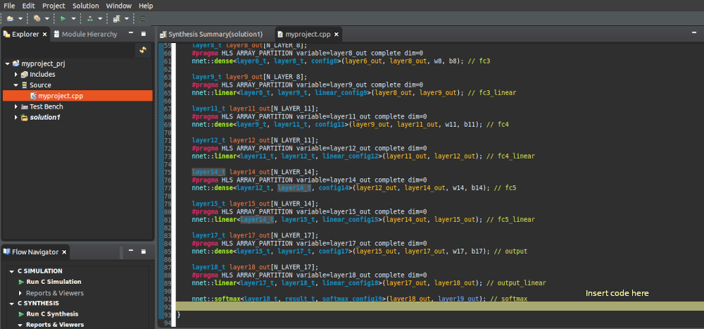
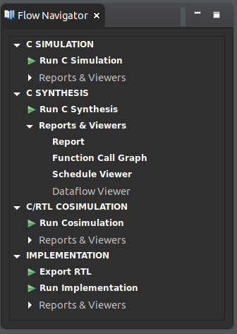
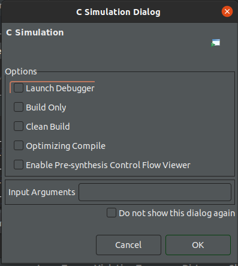
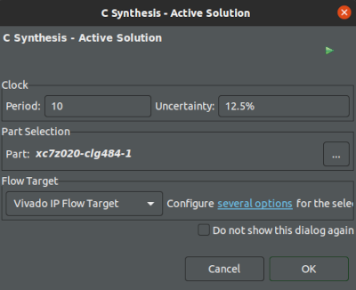
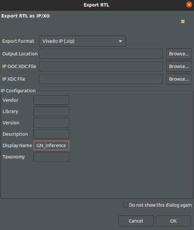
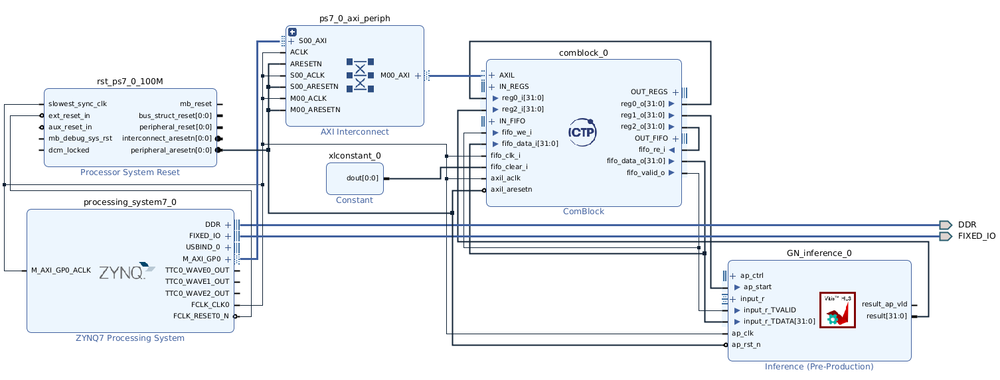

# Creacion de proyecto para entrenar una red neuronal con TF

lo primero es crear el entorno virtual e instalar las librerias, esto se hace con el paquete `virtualenv`

las librerias necesarias son:

- numpy
- matplotlib
- pandas
- seaborn
- tensorflow
- qkeras
- sklearn
- udma (ictp instance)

para esto ejecutar dentro del entorno virtual la instalacion de requerimientos con:

```
pip install -r requirements.txt
```

### HLS desarrollo

- Enlace para acceso a los repositorios ([https://gitlab.com/ictp-mlab/smr-4078]())

Es necesario modificar el IPCore generado para que incluya una interface AXI para los datos,

- Revisar el siguiente Wiki del repositorio
  ([https://gitlab.com/ictp-mlab/smr-4078/-/wikis/Labs/Lab-5-Stage-2]())

## Configuracion en Vitis_HLS

# HLS simulation, synthesis, and implementation

> 🔴 In this part of the laboratory, the folder to be used was created in the previous step within the Jupyter notebook, which is `/home/student/workshop/mylabs/Lab5_HLS4ML/part_2/hlsPrj/`

The verification of the IP's functionality is performed using the Vitis HLS tool. To achieve this, several changes must be made to the generated **.c source** files to add the interfaces and test the IP core. Therefore, the following steps should be performed:

1. Open Vitis HLS. Go to **Applications -> Xilinx Design Tools -> VitisHLS 2022.2** and click Vitis HLS 2022.2.



2. Open the project in the folder **part_2 -> hlsPrj -> myproject_prj**, which was generated in the Jupyter notebook. In this way, the project created with **hls4ml** will be loaded into the Vitis HLS.
3. Perform the following configurations in the project:

   - In the menu, go to **Project -> Project Settings**. Click on **Synthesis**.
   - In the _Synthesis settings_, change the name of the **top function** by **GN_inference**.

     > **Note**: The **top function** acts as the entry point for the Vitis HLS design, linking all input and output ports of the hardware module. It is responsible for setting up the required input values and triggering the hardware module. Once the computation is complete, the **top function** gathers the output values and returns them to the software application.
     >

<!-- - In _Synthesis C/C++ Source files_ part, in the table click in the entry **myproject.cpp** and click in Edit CFLAGS. Replace the text by: **-std=c++14**.  
  
    - Click **OK**. 

<!-- The configuration should look like the image below. 

{width=70%} -->

4. Check the following configurations related to the solution.

   - In the menu, go to **Solution -> Solution Settings**. Click on **Synthesis**.
   - Set the **Clock** in **10**, with an **uncertainty** value of **12.5%**.
   - Select the corresponding part: **xc7z020clg484-1**.
   - Leave the Flow Target as **Vivado IP Flow Target**.
   - Click **OK**.

The configuration should be as shown in the image below.

{width=70%}

🔴 In this step, **several parts of the code need to be added or replaced**.

5. In this step, several parts of the file **myproject.cpp** inside Vitis HLS will be replaced. **The images below will help you to identify the different parts of the code and the place where they should be added.**

   To create an HLS project using **hls4ml** with specific interface directives, especially when dealing with AXI stream interfaces, it is necessary to modify the top-level function and specify the interface pragmas for the input and output ports accordingly. This requires using a specific structure for streaming data depending on the HLS tool (in Vitis HLS, _hls::stream_ is used).

   In this project, only the input port will use an _AXI stream_ interface, while the output port will utilize the _ap_vld_ interface. For the control ports, the _ap_ctrl_hs_ protocol is implemented. Copy the following code

   ```c
   void GN_inference(

   	hls::stream<AXI_VALUE_IN> &input,
   	int *result

   ) {  
       #pragma HLS INTERFACE mode=ap_ctrl_hs port=return
       #pragma HLS INTERFACE axis register both port=input
       #pragma HLS INTERFACE ap_vld port=result
       #pragma HLS PIPELINE

   ```

   replacing the selected parts in the file **myproject.cpp**.

   

   <!--  -->
6. Go to the folder **/home/student/workshop/mylabs/Lab5_HLS4ML/part_2/src_hls** and copy the file **myproject_test.cpp** in the folder **/home/student/workshop/mylabs/Lab5_HLS4ML/part_2/hlsPrj/**. This action will replace the old file.
7. Go to the folder **/home/student/workshop/mylabs/Lab5_HLS4ML/part_2/src_hls** and copy the file **myproject_.h** in the folder **/home/student/workshop/mylabs/Lab5_HLS4ML/part_2/hlsPrj/firmware**. This action will replace the old file.

<!-- 8. Go to the folder **/home/student/workshop/mylabs/Project_ML/part_2/src_hls** and copy the file **defines.h** in the folder **/home/smr4078/workshop/mylabs/Project_ML/part_2/hlsPrj/firmware**. This action will replace the old file.  -->

8. In Vitis HLS, in the **Explorer** pane, open the file **Source -> myproject.cpp**.

   🔴 Then, the following code should be added in the file **myproject.cpp**. This change allows unpack the input stream in a vector to be used by the algorithm.

   ```c
   AXI_VALUE_IN valIn;

   input_t inputLayer[N_INPUT_1_1];
   result_t layer19_out[N_LAYER_17];

   #pragma HLS ARRAY_RESHAPE variable=inputLayer complete dim=0
   #pragma HLS ARRAY_PARTITION variable=layer19_out complete dim=0

   for(int h=0; h<N_INPUT_1_1; h++){
   #pragma HLS PIPELINE
   	// Read and cache value
   	valIn = input.read();
   	inputLayer[h] = valIn.data;
   }
   ```

   The previous code should be placed after the line **#endif** (line number 36) in the file **myproject.cpp**.

   

   <!--  -->

   🔴 The following code allows to output the discrimination results.

   ```c
    int tmpVal = 0;
    if(layer19_out[0] > 0.5){
    	// Value 2 corresponds to class 0 gamma
    	tmpVal = 5;
    	*result = tmpVal;
    }
    else {
    	// Value 3 corresponds to class 1 neutron
    	tmpVal = 3;
    	*result = tmpVal;

    }
   ```

   Add the previous code before the last **\}** in  **myproject.cpp** file. Use the following image as reference.

   

Once the code modifications are complete, it is time to analyze how the IP core behaves when gamma or neutron signals are used as inputs.

9. Go to the flow navigator pane (left bottom corner).  Under **C SIMULATION**, click on **Run C Simulation**.

   
10. A _C Simulation Dialog_ will appear. Click **OK**. The simulation will start. Wait for the results.

    
11. After the simulation, in the Flow Navigator pane, under **C SYNTHESIS**, click on **Run C Synthesis**. A pop-up window will appear with configurations for the active solution, displaying the values for the clock, FPGA part, and flow target. Leave these settings as they are and click the **OK** button. Wait for the synthesis report.

    
12. The final step is generate the IP core. In the flow navigator pane (left bottom corner), under **IMPLEMENTATION**, click on **Export RTL**. In the **Display Name** option, add the name **GN_inference**. Click the **OK** button. Wait until the export process is completed.

    

With the generated IP core, it is time to test the inference process in the SoC platform.





## References

[1] Molina, R. S., Morales, I. R., Crespo, M. L., Costa, V. G., Carrato, S., & Ramponi, G. (2024). An End-to-End Workflow to Efficiently Compress and Deploy DNN Classifiers On SoC/FPGA. IEEE Embedded Systems Letters, 16(3), 255-258.

[2] Morales, I. R., Crespo, M. L., Bogovac, M., Cicuttin, A., Kanaki, K., & Carrato, S. (2024). Gamma/neutron classification with SiPM CLYC detectors using frequency-domain analysis for embedded real-time applications. Nuclear Engineering and Technology, 56(2), 745-752.

[3] Zhou, W., Cui, T., Zhang, Z., Yang, Y., Yi, H., & Hou, D. (2023). Measurement of wide energy range neutrons with a CLYC (Ce) scintillator. Journal of Instrumentation, 18(02), P02014.
